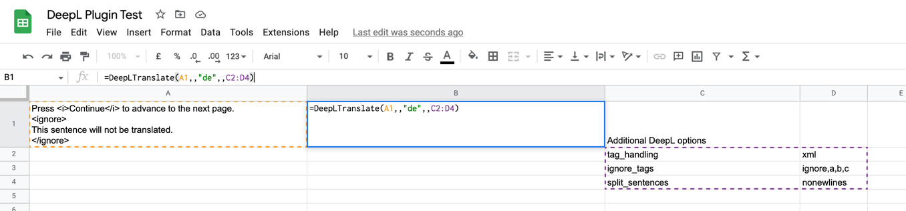
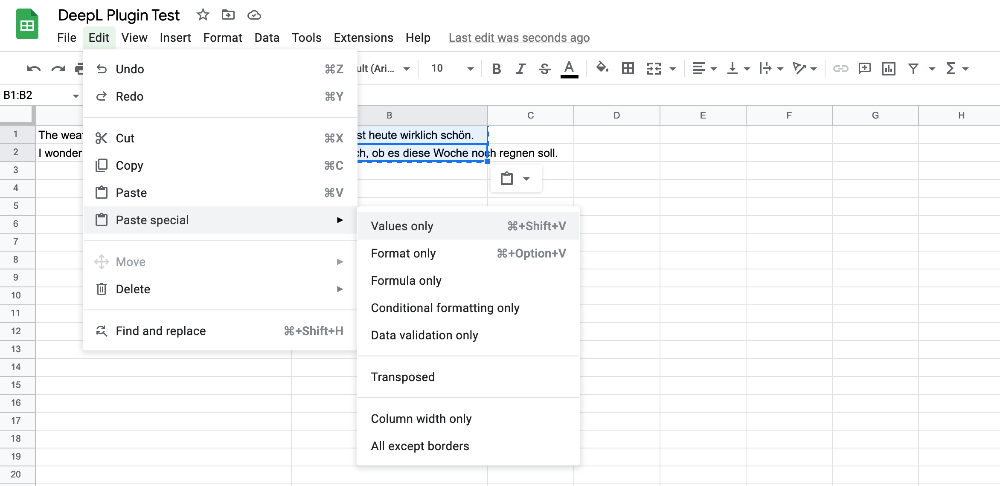

# DeepL Formula Functions

The script includes two spreadsheet formula functions — `DeepLTranslate()` and
`DeepLUsage()` — that let you translate cell values directly using formulas.

These functions are included for backward-compatibility with the original
version of the script, where they are replaced by the sidebar.
They are not required for the latest version.

These functions are **disabled by default**. Before enabling them, read the cost
warning below.

## Enabling formula functions

Open **Extensions → Apps Script**, find this line near the top of `DeepL.gs`,
and change `false` to `true`:

```js
const enableFormulaFunctions = false;
```

Save the script and reload your sheet. The functions will then be available.

## Cost warning

Formula cells are recalculated every time the sheet is reopened. If your sheet
contains `DeepLTranslate()` formulas, **reopening it will re-translate every
formula cell and charge those characters against your quota**, even if the source
text has not changed.

DeepL API Pro subscribers can set a monthly cost control limit to cap unexpected
charges. [Instructions are in the DeepL help center][cost-control]. Free tier
accounts are limited to 500,000 characters per month.

See [Re-translation workarounds](#re-translation-workarounds) below for ways to
mitigate this.

The sidebar approach (described in the main [README](README.md)) does not have
this problem — it writes static values that are never recalculated — so it is
recommended for most users.

## DeepLTranslate

Translates text from one language to another.

```
=DeepLTranslate(input, [sourceLang], [targetLang], [glossaryId], [options])
```

| Parameter | Description |
|---|---|
| `input` | The text to translate (required). |
| `sourceLang` | Source language code, e.g. `"EN"`. Use `"auto"` or omit to auto-detect. |
| `targetLang` | Target language code, e.g. `"DE"`. Defaults to your system language if omitted. |
| `glossaryId` | ID of a DeepL glossary to apply. Requires `sourceLang` to also be set. |
| `options` | A two-column range or inline array of additional API options (see below). |

### Examples

```
=DeepLTranslate("Bonjour!")
    → "Hello!" (or equivalent in your system language)

=DeepLTranslate("Guten Tag", "auto", "FR")
    → "Bonjour"

=DeepLTranslate("Hello", "EN", "DE", "61a74456-b47c-48a2-8271-bbfd5e8152af")
    → "Moin" (using a glossary)
```

### Additional options

Pass extra DeepL API parameters via a two-column range where the first column
is the option name and the second is the value:

```
=DeepLTranslate(A1,,"DE",,C2:D4)
```



When translating multiple cells, make the options reference absolute:

```
=DeepLTranslate(A1,,"DE",,$C$2:$D$4)
```

Options can also be passed inline:

```
=DeepLTranslate(A1,,"DE",,{"tag_handling","xml";"ignore_tags","ignore,a,b,c"})
```

## DeepLUsage

Returns API character usage for the current billing period.

```
=DeepLUsage([type])
```

| Parameter | Description |
|---|---|
| `type` | Omit for a summary string. Pass `"count"` for the number used, `"limit"` for the monthly limit. |

### Examples

```
=DeepLUsage()
    → "106691 of 500000 characters used."

=DeepLUsage("count")
    → 106691

=DeepLUsage("limit")
    → 500000
```

## Re-translation workarounds

### Paste special — Values only

After translating with `DeepLTranslate`, copy the cell and use
**Edit → Paste special → Values only** to replace the formula with plain text.
The cell will no longer recalculate.



This also works on a range: select all translated cells, copy, then paste
values only.

### Set up Cost Control

DeepL API Pro subscribers can cap monthly spend in their account settings.
[Instructions are in the DeepL help center][cost-control].

### disableTranslations flag

Set `disableTranslations = true` in `DeepL.gs` to prevent all formula
translations without removing the formulas from cells. Existing translated
values will be returned as-is.

### activateAutoDetect flag

Set `activateAutoDetect = true` in `DeepL.gs` to enable automatic detection of
cell recalculations. When active, cells that already have a translated value
will not be re-translated on reopen. This is disabled by default because it is
not fully reliable.

### Remove the API key

Removing `DEEPL_API_KEY` from Script Properties will cause all formula
functions to error, preventing any translations — and any charges.

[cost-control]: https://support.deepl.com/hc/en-us/articles/360020685580-Cost-control
