# DeepL API - Google Sheets Example

In the past few months, we've heard a lot of requests for code samples or
example projects for the DeepL API. We think this is a great idea! This Google
Sheets example is the first such code sample that we've released, and we hope it
can serve as inspiration or help you as you work through your own project.

The plugin is open source under the MIT License.

Instructions for getting started are below. If you have any questions or
comments, please [create a GitHub issue][issues] to let us know. We'd be happy
to hear your feedback.

## Requirements

### DeepL API Authentication Key

To use this plugin, you'll need a DeepL API authentication key. To get a key,
[please create an account here][pro-account]. With a DeepL API Free account, you
can translate up to 500,000 characters/month for free.

### Google Account

You'll also need a Google account so that you can create a Google Sheet then set
up and use the plugin.

## Support Disclaimer

The DeepL support team does *not* provide support for this plugin. Please keep
this in mind when you're deciding whether or not to use the plugin.

If you have a question, issue, or feedback related to the plugin, we welcome you
to [create an issue][issues] in GitHub. We'll respond to GitHub issues on a
"best effort" basis.

## Cost Control and API Consumption Disclaimer

While DeepL's Free API accounts allow you to translate up to 500,000 characters
per month for free, our Pro API accounts include a monthly base price +
pay-as-you-go usage pricing. [You can see pricing details here][pro-account].

__Important note:__ there's a known issue with the add-on where re-opening an existing 
Sheet that contains DeepL API add-on formulas will "re-translate" all cells, and these 
re-translations will count against your API character consumption.

We've attempted a couple of workarounds here (trying to "detect" when cells have 
already been translated, adding a flag a user can set in the script to disable 
formulas altogether), but we haven't yet figured out an ideal solution. 
Ideas are welcome!

We also know that in Google Sheets, because a formula can be copied and pasted 
with just a few keystrokes, it can be easy to translate a lot of characters 
eally quickly—and maybe translate more than you intended.

In the Setup Guide and Tutorial below, we include guidelines on:

* Setting up Cost Control in your DeepL account (applies to Pro API accounts only) ([Jump to section](#cost-control-section))
* Copy and pasting values so that you don't accidentally "re-translate" content (and consume API characters that will be counted against your usage) every time you open up a Google Sheet that uses the add-on ([Jump to section](#paste-special-section))

__Please review these guidelines if you plan to use the add-on!__ We don't want anyone 
unintentionally translating more than they'd planned.

## Setup Guide

These instructions were written so that non-developers can also use the add-on
🙂

This guide walks you through setup using a new, blank Google Sheet. But you can
also use the add-on with an existing Sheet (including if that Sheet already has
App Scripts). In the case of a sheet that already has App Scripts, you'd simply
need to add a new App Script file (e.g. named "DeepL.gs") and add the code
provided below.

__Create a new Google Sheet.__

In the top toolbar, click on "Extensions" then "Apps Script".
  
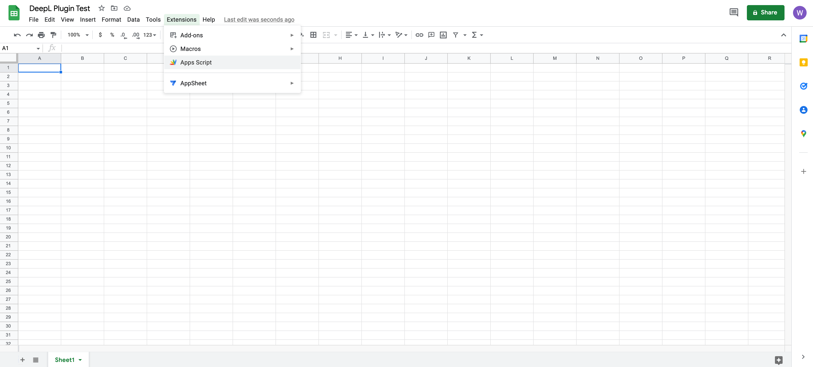

A new Apps Script tab will open. It should look something like this:

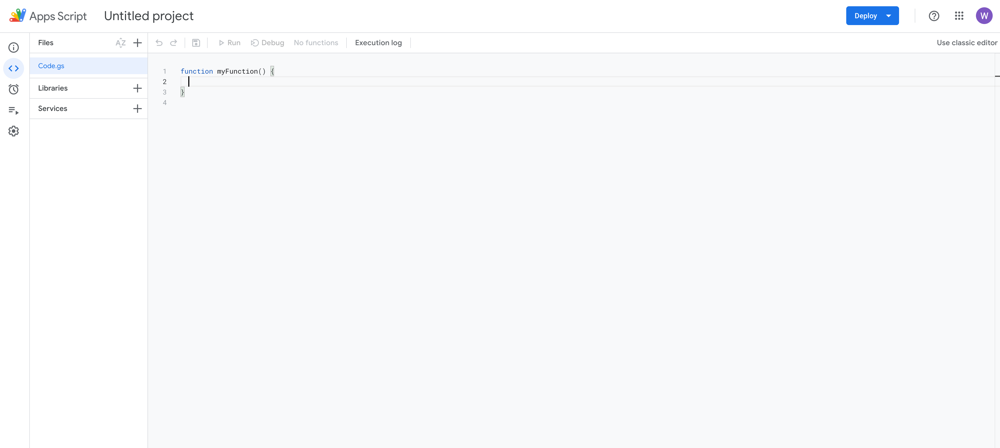

__Delete the function myFunction()... placeholder code so that this "Code.gs"__
__section on the Apps Script tab is completely empty.__

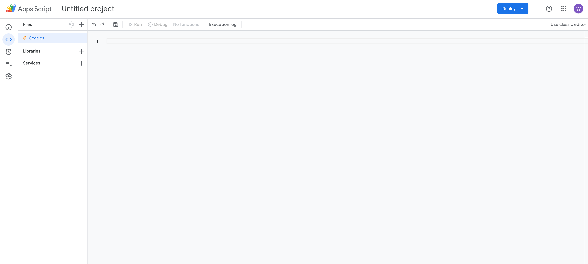

Replace the "Code.gs" section in the Apps Script tab with the contents of the 
"DeepL.gs" file in this git repository.
[Click here][deepl-gs] to get the raw contents from GitHub, and copy and paste
the contents into the Apps Script tab.

__Go to deepl.com and sign in to your DeepL API account__

If you don't yet have a DeepL API account, [please create one here][pro-account].

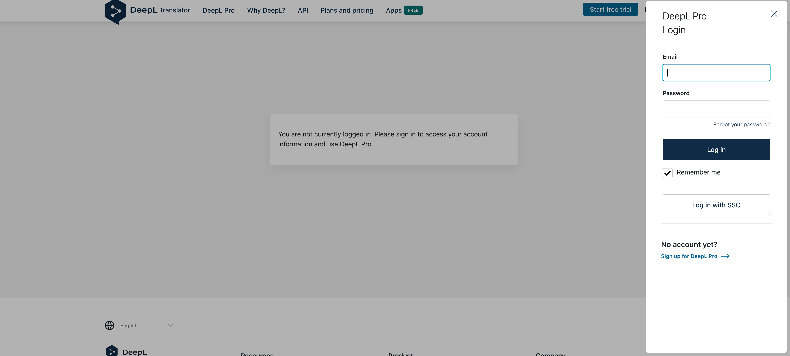

__Go to the Account tab in your API account__

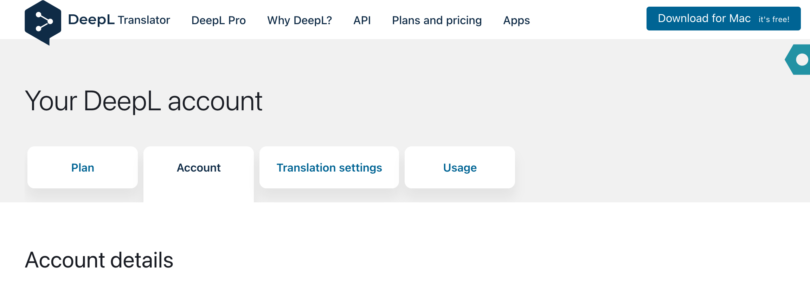

__Scroll down to find your authentication key.__

Copy your authentication key.

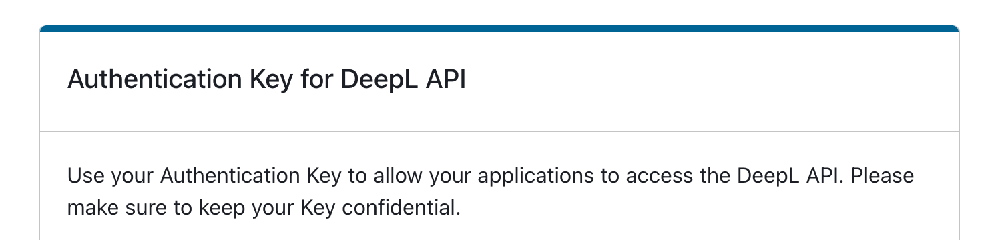

__Pro API subscribers only: activate Cost Control (optional)__ <a name="cost-control-section"></a>

Free API subscribers can skip this step.

[Instructions for activating cost control are available in the DeepL help center][cost-control]. 

If you're a Pro API subscriber, we recommend setting a cost control limit if you have a firm monthly budget for your DeepL API usage. 

__Go back to the Apps Script tab. Paste your DeepL API authentication key in__
__between the quotation marks (" ") on line 2 of the Code.gs file.__

Line 2 of the Code.gs file should look something like this:
```javascript
const auth_key = "abcd123-ab12-111-2222-a1a1a1a1a123abc:fx"; // Replace with your authentication key
```

__Rename your Apps Script project__

Click on the "Untitled project" title and give the project a new name. You can
use any name you like.

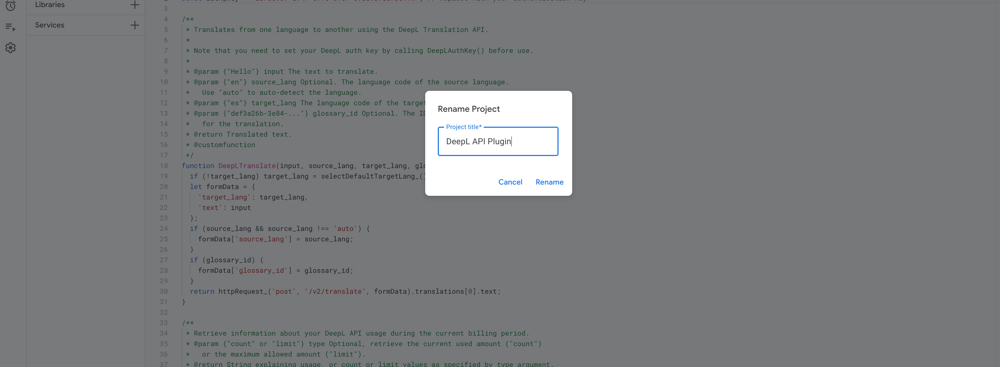

__Click on the "Save" icon in the Apps Script toolbar__

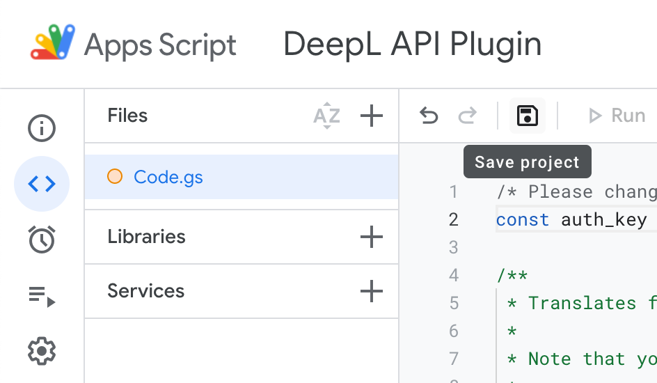

You can now close the Apps Script tab and navigate back to the Sheet you created
at the start of setup. Let's get translating!

## Usage Guide

The example includes two functions: `DeepLTranslate` and `DeepLUsage`.

Each function has "pop-up" documentation that you'll see when you start typing
it into a cell in your sheet.

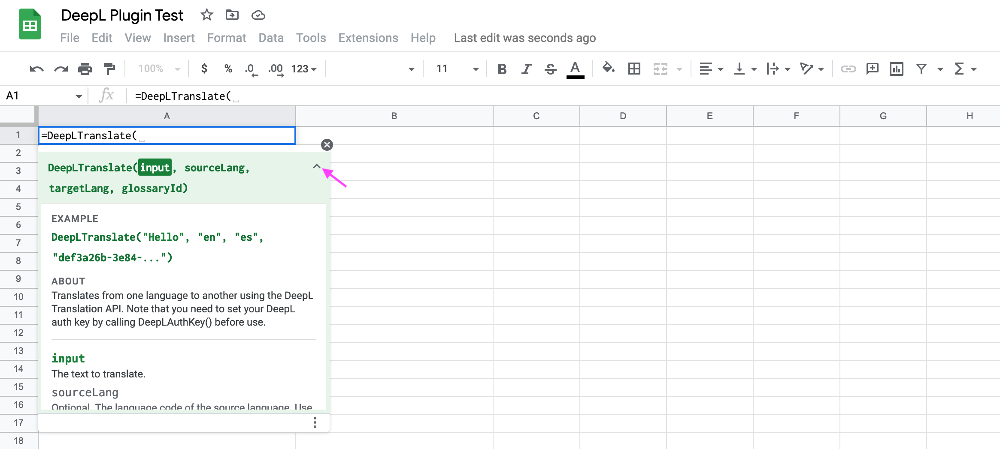
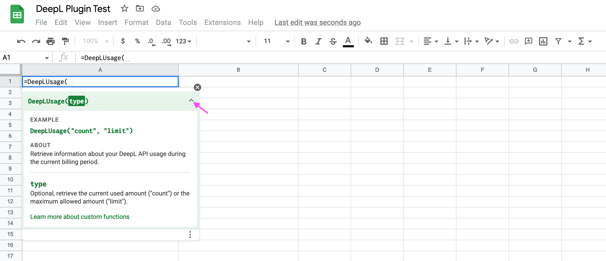

Note that you cannot create glossaries using this Google Sheets add-on. You can
only reference glossary IDs of glossaries that were already created with the
DeepL API.

In addition, here are some examples that might help you get started.

```
=DeepLTranslate("Bonjour!")
    “Hello!” (or equivalent in your system language)

DeepLTranslate("Guten Tag", "auto", "FR")
    “Bonjour”

=DeepLTranslate("Hello", "en", "de", "61a74456-b47c-48a2-8271-bbfd5e8152af")
    “Moin” (translating using a glossary)

=DeepLUsage()
    “106691 of 500000 characters used.”

=DeepLUsage("count")
    106691
```

## A Quick Tutorial

Type some sample source text into cells A1 and A2.

I'll use the following sentences:
* "The weather sure is nice today."
* "I wonder if it's supposed to rain later this week."

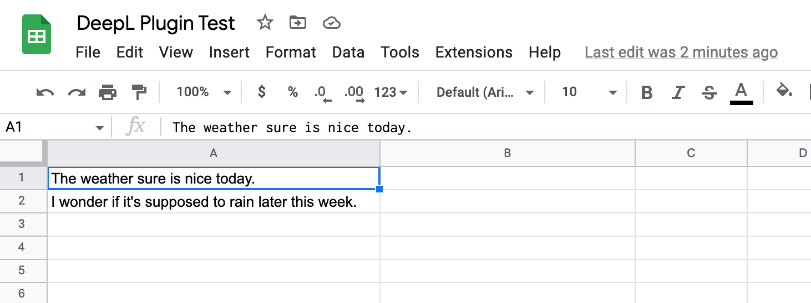

In cell B1, type `=DeepLTranslate(` to start using the DeepL function we created.


We'll use the following parameters:
* `input`: A1 (cell A1—but you can also type in your own text)
* `source_lang`: "auto" (DeepL will auto-detect the source language)
* `target_lang`: "DE" (German—or feel free to select a 2-letter language code of
  your choice from the [target_lang section on this page][api-languages])
* `glossary_id`: We'll skip this parameter, as we aren't using a glossary in
  this example.

The resulting function call will look like this:

```=DeepLTranslate(A1, "auto", "DE")```

Press enter to run the function.

Success! Cell A1 was translated into German.

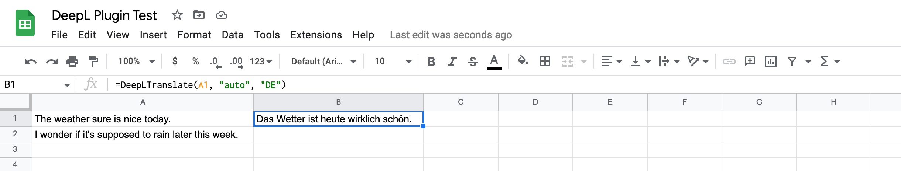

To translate our second cell of source text, you can copy cell B1 and paste it
into B2.

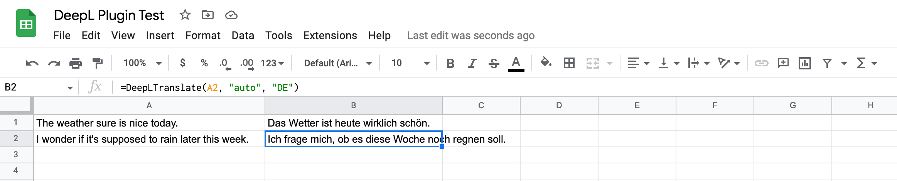

__If you'd like to avoid re-translating (and using API characters) every time__
__you open this sheet, copy and paste the values of cells B1 and B2.__ <a name="paste-special-section"></a>

After copying cells B1 and B2, go to "Paste special", then click on "Values
only". You can also use the keyboard shortcut shown in this menu.

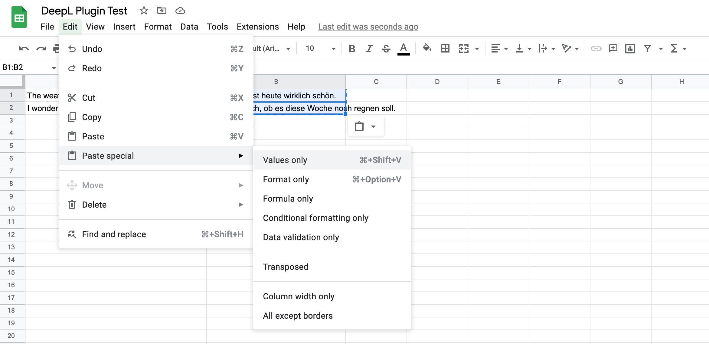

Congrats! You've reached the end of this tutorial. Happy translating!

[api-languages]: https://www.deepl.com/docs-api/translating-text?utm_source=github&utm_content=google-sheets-plugin-readme&utm_medium=readme

[deepl-gs]: https://raw.githubusercontent.com/DeepLcom/google-sheets-example/main/DeepL.gs

[issues]: https://github.com/DeepLcom/google-sheets-example/issues

[pro-account]: https://www.deepl.com/pro?utm_source=github&utm_content=google-sheets-plugin-readme&utm_medium=readme#developer

[cost-control]: https://support.deepl.com/hc/en-us/articles/360020685580-Cost-control

