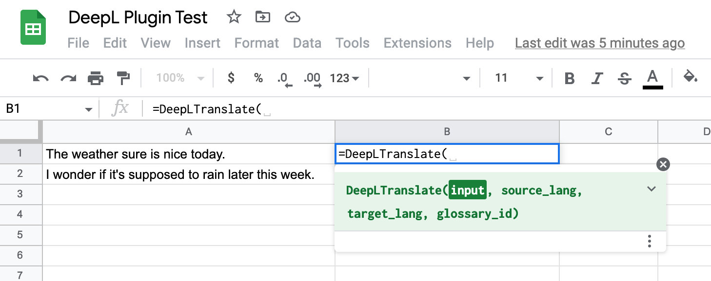

# DeepL API - Google Sheets Example

In the past few months, we've gotten a lot of requests for code samples or
example projects for the DeepL API. We think this is a great idea! This Google
Sheets example is the first such code sample that we've released, and we hope it
can serve as inspiration or help you as you work through your own project.

**Disclaimer**: the DeepL support team does *not* provide support for this
example project. Please keep this in mind when deciding whether to use it.

Instructions for getting started are below. If you have any questions or
comments, please [create a GitHub issue][issues] to let us know. We'd be happy
to hear your feedback.

## Requirements

### DeepL API Authentication Key

To use this plugin, you'll need a DeepL API authentication key. To get a key,
[please create an account here][pro-account]. With a DeepL API Free account, you
can translate up to 500,000 characters/month for free.

### Google Account

You'll also need a Google account to use Google Sheets. Please ensure you comply
with all applicable terms of service when using third-party products such as
Google Sheets.

## Cost Control and API Consumption Disclaimer

While DeepL's Free API accounts allow you to translate up to 500,000 characters
per month for free, our Pro API accounts include a monthly base price +
pay-as-you-go usage pricing. [You can see pricing details here][pro-account].

**Important note:** there's a known issue with the add-on where re-opening an
existing Sheet that contains DeepL API add-on formulas will "re-translate" all
cells, and these re-translations will count against your API character
consumption.

We've built a couple of workarounds into the script (trying to "detect" when
cells have already been translated, adding a flag a user can set in the script
to disable re-translation altogether), but we haven't yet figured out an ideal
solution. Ideas are welcome!

We also know that in Google Sheets, because a formula can be copied and pasted 
with just a few keystrokes, it can be easy to translate a lot of characters 
very quickly — and maybe translate more than you intended.

In the [Re-translation Workarounds](#re-translation-workarounds) section below,
we explain some methods to avoid this.

**Please review these guidelines** if you plan to use the add-on! We don't want
anyone to unintentionally translate more than they'd planned.

## Setup

1. In your Google Sheet, from the "Extensions" menu select "Apps Script" to open
   the Apps Script editor.
2. Create a script file named `DeepL.gs` and copy the contents of the
   [DeepL.gs][deepl-gs-raw] file in this repo into it.
3. Modify line 26 of the script to include your DeepL Authentication Key. This 
   line looks like `const authKey = "..";`, and it comes after the license text. 
4. Close the Apps Script editor and return to your sheet.
5. Use the `DeepLTranslate` and `DeepLUsage` functions as explained in 
   [Usage](#usage).

You should review the [Re-translation Workarounds](#re-translation-workarounds)
to avoid translating more than you intend.

### Setup tutorial

These instructions were written so that non-developers can also use the add-on
🙂.

This guide walks you through setup using a new, blank Google Sheet. But you can
also use the add-on with an existing Sheet (including if that Sheet already has
App Scripts). In the case of a sheet that already has App Scripts, you'd simply
need to add a new Apps Script file (e.g. named "DeepL.gs") and add the code
provided below.

__Create a new Google Sheet. In the top toolbar, click on "Extensions" then "Apps Script".__
  


A new Apps Script tab will open. It should look something like this:


__Delete the function myFunction()... placeholder code so that this "Code.gs"__
__section on the Apps Script tab is completely empty.__


Replace the "Code.gs" section in the Apps Script tab with the contents of the 
"DeepL.gs" file in this git repository.
[Click here][deepl-gs-raw] to get the raw contents from GitHub, and copy and
paste the contents into the Apps Script tab.

__Go to deepl.com and sign in to your DeepL API account__

If you don't yet have a DeepL API account, [please create one here][pro-account].


__Go to the Account tab in your API account__


__Scroll down to find your authentication key.__

Copy your authentication key.


__Go back to the Apps Script tab. Paste your DeepL API authentication key in__
__between the quotation marks (" ") on line 26 of the Code.gs file.__

Line 26 of the Code.gs file should look something like this:
```javascript
const authKey = "ab7be987-af47-8776-815f-0fad93fe87b8:fx"; // Replace with your authentication key
```

__Rename your Apps Script project__

Click on the "Untitled project" title and give the project a new name. You can
use any name you like.


__Click on the "Save" icon in the Apps Script toolbar__


You can now close the Apps Script tab and navigate back to the Sheet you created
at the start of setup. Let's get translating!

## Usage

The example includes two functions: `DeepLTranslate` and `DeepLUsage`.

Each function has "pop-up" documentation that you'll see when you start typing
it into a cell in your sheet.


Note that you cannot create glossaries using this Google Sheets add-on. You can
only reference glossary IDs of glossaries that were already created with the
DeepL API.

In addition, here are some examples that might help you get started.

```
=DeepLTranslate("Bonjour!")
    “Hello!” (or equivalent in your system language)

DeepLTranslate("Guten Tag", "auto", "FR")
    “Bonjour”

=DeepLTranslate("Hello", "en", "de", "61a74456-b47c-48a2-8271-bbfd5e8152af")
    “Moin” (translating using a glossary)

=DeepLUsage()
    “106691 of 500000 characters used.”

=DeepLUsage("count")
    106691
```

### Usage Tutorial

Type some sample source text into cells A1 and A2.

I'll use the following sentences:
* "The weather sure is nice today."
* "I wonder if it's supposed to rain later this week."


In cell B1, type `=DeepLTranslate(` to start using the DeepL function we created.



We'll use the following parameters:
* `input`: A1 (cell A1—but you can also type in your own text)
* `source_lang`: "auto" (DeepL will auto-detect the source language)
* `target_lang`: "DE" (German—or feel free to select a 2-letter language code of
  your choice from the [target_lang section on this page][api-languages])
* `glossary_id`: We'll skip this parameter, as we aren't using a glossary in
  this example.

The resulting function call will look like this:

```=DeepLTranslate(A1, "auto", "DE")```

Press enter to run the function.

Success! Cell A1 was translated into German.


To translate our second cell of source text, you can copy cell B1 and paste it
into B2.


Congrats! You've reached the end of this tutorial. Happy translating!

### Additional options

The `DeepLTranslate()` function allows you to specify additional DeepL API
options to include in your translation requests. This allows you to specify tag
handling options, sentence-splitting, and so on. 

The fifth argument to `DeepLTranslate()` accepts the options specified as a
range with two columns: the option name and option values. You can specify the 
options somewhere in the sheet and refer to them in your translations, as shown
in the following example:

```=DeepLTranslate(A1,,"de",,C2:D4)```


Note that the `source_lang` and `glossary_id` parameters are used in this
example, so they are empty.

If you are translating multiple cells, you may want to make the reference to the
options absolute (`$C$2:$D$4`).

#### Inline formula options

Google Sheets also allows you to specify ranges in a formula using the
`{opt1, val1; opt2, val2; ..}` syntax, for example:

```=DeepLTranslate(A1,,"de",,{"tag_handling", "xml"; "ignore_tags", "ignore,a,b,c"})```

## Re-translation Workarounds

### Set up Cost Control

DeepL API Pro subscribers can activate Cost Control in their account. 
[Instructions for activating cost control are available in the DeepL help center][cost-control].

If you're a DeepL API Pro subscriber, we recommend setting a cost control limit
if you have a firm monthly budget for your DeepL API usage.

Cost Control is not available to DeepL API Free users; they are limited to
500,000 characters per month.

### Copy-Paste "Values only"

After you have used the `DeepLTranslate` function to get a translation in a
cell, you can use this workaround to "freeze" the result, so that it will not
be re-translated.

Copy the cell you want to freeze, then use "Paste special", "Values only" on
the same cell. You can also do this with multiple cells in a range.

For example, after translating into cells B1 and B2, we can freeze their results.
Copying cells B1 and B2, then in the "Edit" menu, go to "Paste special", then
click on "Values only".
You can also use the keyboard shortcut applicable to your operating system.


### Script `disableTranslations` Flag

At the top of the provided script ([DeepL.gs](DeepL.gs)), there is a
`disableTranslations` variable to disable all translations. If you set it to
`true` and save the script, the `DeepLTranslate` function will be disabled and
already-translated cells will not be re-translated.

### Built-in re-translation detection

Automatic re-translation detection is built-in to the script, however it is
disabled by default because unfortunately tests have shown the detection
technique used is not fully reliable.

There is an `activateAutoDetect` variable at the top of the provided script
([DeepL.gs](DeepL.gs)) to activate the automatic re-translation detection. Set
it to `true` to enable this feature.

## Contributing feedback and improvements

We welcome your feedback and questions about the project. Please feel free 
to [create a GitHub issue][issues] to get in touch with us.

If you'd like to contribute to the project, please open a [pull request][pull-requests]. 
Our contributing guidelines apply to all contributions. 

[api-languages]: https://www.deepl.com/docs-api/translating-text?utm_source=github&utm_content=google-sheets-plugin-readme&utm_medium=readme

[deepl-gs-raw]: https://raw.githubusercontent.com/DeepLcom/google-sheets-example/main/DeepL.gs

[issues]: https://github.com/DeepLcom/google-sheets-example/issues

[pull-requests]: https://github.com/DeepLcom/google-sheets-example/issues

[pro-account]: https://www.deepl.com/pro?utm_source=github&utm_content=google-sheets-plugin-readme&utm_medium=readme#developer

[cost-control]: https://support.deepl.com/hc/en-us/articles/360020685580-Cost-control

